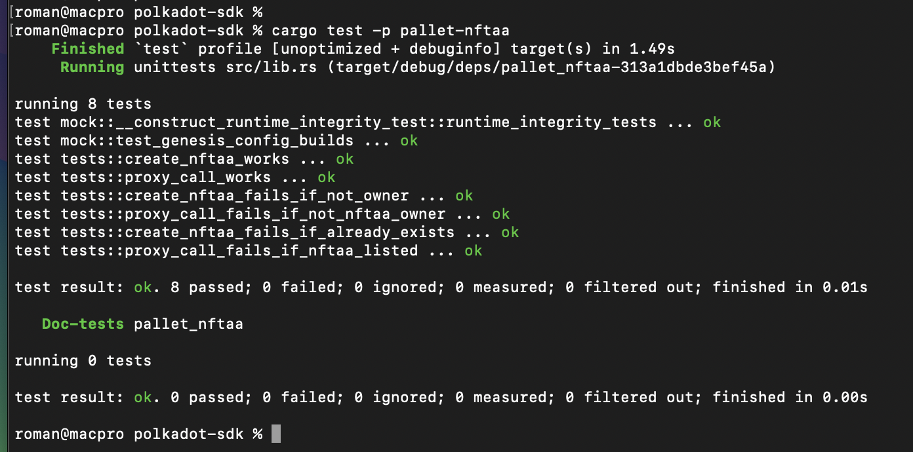

# NFTAA Proposal

This is the proposal for the NFTAA pallet. For more information, as well as details on the required runtime configuration, please refer to the [README in the pallet repository](https://github.com/decenzio/nftaa/blob/main/README.md).

## How to run?

### Docker
For dockerized version you need to build image first using:

```sh
docker build --platform linux/x86_64 -t polkadot-sdk-image:latest .
```

And than run zombienet instance with:

```sh
docker run --platform linux/x86_64 -p 9910-9913:9910-9913 -p 9920-9921:9920-9921 --rm -it polkadot-sdk-image:latest
```

### Local development

Alternatively for local development we recommend download our fork of polkadot-sdk

```sh
git clone https://github.com/decenzio/polkadot-sdk.git --branch dev --recurse-submodules
```

Inside folder `binaries` download [zombienet](https://github.com/paritytech/zombienet/releases) instance. Then add execution rights:
```sh
cd binaries
chmod +x ./zombienet
```

Then you need to build relay node:
```sh
cargo b -r -p polkadot
```

And parachain template:
```sh
cargo build --release -p parachain-template-node
```

After that we can launch nodes with zombienet:
```sh
cd binaries
./zombienet -p native -c 1 spawn config.toml
```

### App interaction
For now, you can interact with the pallet using the following link: [Polkadot.js Explorer](https://polkadot.js.org/apps/?rpc=ws://127.0.0.1:9920#/explorer). Later, interaction through a web app will also be possible.

## Testing 

### Manual
Manual testing can currently be performed by directly calling pallet methods following the procedure outlined in the [App Interaction section](#app-interaction).

Here is an example of the basic flow:
1. Call `create` to create an NFTAA collection (similar to creating a standard NFT collection).
2. Mint an NFTAA using the `mint` function (similar to minting a standard NFT).
3. Find the address of the created NFTAA in the event list.
4. Using the same account as the NFTAA owner, use `proxy_call` to perform actions via the new NFTAA. For example, you can call `system remark`.
5. Change to a random account (one that is not the NFTAA owner) and try step 4 again. You should encounter an error.
6. Transfer the NFTAA via `transfer` (similar to transferring a standard NFT) to a new account. Then try step 4 from the old account; you should encounter an error.
7. Switch to the new owner of the NFTAA and retry step 4. This should work without any errors.

### Run Automatic Tests




To run automatic tests, follow these steps:

0. Check your Rust version:
   ```sh
   rustc --version           
   rustc 1.84.0 (9fc6b4312 2025-01-07)
   ```

1. Clone our `polkadot-sdk` fork along with its submodules:
   ```sh
   git clone https://github.com/decenzio/polkadot-sdk.git --branch dev --recurse-submodules
   ```

2. Navigate to the `polkadot-sdk` folder and run:
   ```sh
   cargo test -p pallet-nftaa
   ```

In case of problems, check the Rust version (point 0.) and use the following commands to update if necessary:

   ```sh
   rustup default stable
   rustup update
   rustup target add wasm32-unknown-unknown
   ```

   ```sh
   rustup update nightly
   rustup target add wasm32-unknown-unknown --toolchain nightly
   ```
